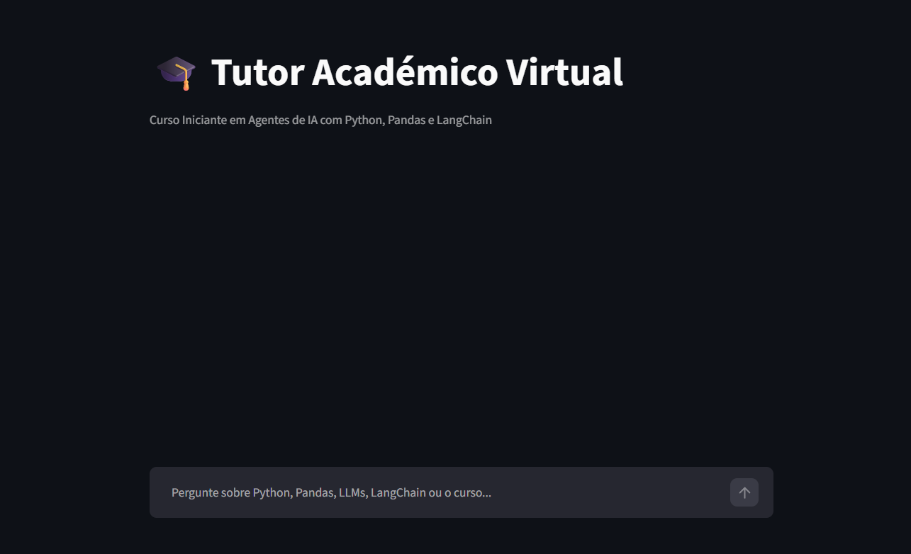
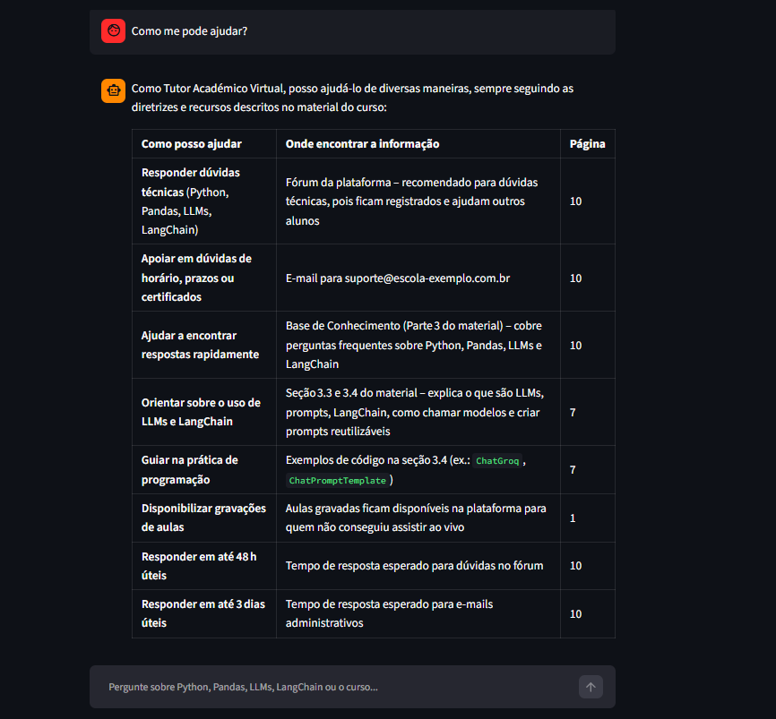

# Challenge Alura Agente — Tutor Académico Virtual

Agente de IA que atua como tutor de um **curso iniciante de Agentes de IA que aborda Python, Pandas, LLM's e LangChain**. Os alunos conversam em linguagem natural para tirar dúvidas técnicas (Python, Pandas, LLMs, LangChain) e administrativas (calendarização, docentes, prazos, suporte) — sempre com base no material oficial do curso, sem inventar informação.

> **Demo online:** [challenge-ai-tech-builder.streamlit.app](https://challenge-ai-tech-builder.streamlit.app/)

---

## Índice

- [Objetivo do MVP](#objetivo-do-mvp)
- [Arquitetura](#arquitetura)
- [Estrutura do repositório](#estrutura-do-repositório)
- [Capturas de ecrã](#capturas-de-ecrã)
- [O material de referência](#o-material-de-referência)
- [Exemplos de perguntas e respostas](#exemplos-de-perguntas-e-respostas)
- [Como usar localmente](#como-usar-localmente)
- [Deploy no Streamlit Community Cloud](#deploy-no-streamlit-community-cloud)
- [Processo de desenvolvimento](#processo-de-desenvolvimento)
- [Desafios e decisões durante o desenvolvimento](#desafios-e-decisões-durante-o-desenvolvimento)
- [Limitações conhecidas](#limitações-conhecidas)

---

## Objetivo do MVP

1. **Processar um ou mais documentos** — o agente lê dois PDFs fixos (o material do curso e a calendarização), extrai o texto e organiza-o para consulta.
2. **Responder perguntas** — um agente de IA busca a resposta nesse material e devolve-a em linguagem natural, clara e direta.
3. **Rodar na nuvem** — a aplicação é implantada no Streamlit Community Cloud, acessível publicamente.

---

## Arquitetura

O projeto segue um pipeline de **RAG (Retrieval-Augmented Generation)**:

```
┌──────────────┐     ┌───────────────┐     ┌─────────────────────┐     ┌───────────────┐
│  2 PDFs      │ --> │   Limpeza +   │ --> │  Embeddings (Gemini) │ --> │  Índice FAISS  │
│  fixos       │     │   Chunking    │     │                      │     │                │
│ (data/)      │     │  (LangChain)  │     │                      │     │                │
└──────────────┘     └───────────────┘     └─────────────────────┘     └───────┬────────┘
                                                                                │
                                                                                ▼
┌──────────────┐   ┌────────────────┐   ┌────────────────┐   ┌───────────────────────┐
│  Resposta    │ <- │  LLM (Groq /   │ <- │  Prompt de     │ <-│  Retriever: busca os  │
│  do tutor    │   │  gpt-oss-20b)  │   │  Tutor Académico│  │  4 trechos mais         │
│              │   │                │   │  + contexto     │  │  parecidos com a       │
│              │   │                │   │                 │  │  pergunta              │
└──────────────┘   └────────────────┘   └────────────────┘   └───────────────────────┘
```

**Componentes e por que foram escolhidos:**

Este é um agente de IA para um Curso Iniciante de Agentes de IA, que aborda Python, Pandas, LLM's e LangChain — por isso a arquitetura foi pensada para ser simples de seguir e justificar, sem camadas desnecessárias.

- **Orquestração — [LangChain](https://python.langchain.com/):** usado para padronizar o carregamento de PDFs, a divisão em chunks e a montagem dos prompts, o que evita escrever essa lógica do zero.

- **Carregamento — `PyPDFLoader`:** extrai o texto de cada página do PDF, mantendo metadados úteis como o número da página(page_label), usado depois para citar a fonte na resposta.

- **Divisão em chunks — `RecursiveCharacterTextSplitter` (chunk_size=1000, overlap=150):** optou-se por pedaços de texto grandes o suficiente para cobrir um parágrafo inteiro, com sobreposição entre pedaços vizinhos para não cortar uma ideia a meio.

- **Embeddings — Google Gemini (`gemini-embedding-001`):** transforma cada chunk num vetor numérico, permitindo procurar por significado e não apenas por palavras exatas.

- **Banco vetorial — [FAISS](https://github.com/facebookresearch/faiss):** guarda os vetores localmente e permite uma busca rápida por similaridade semântica, sem precisar de um servidor de base de dados externo.

- **LLM de geração — [Groq](https://groq.com/) (`openai/gpt-oss-20b`):** gera a resposta final a partir do contexto encontrado; gratuito e rápido, com organização do conteúdo bastante satisfatória.

- **Interface — [Streamlit](https://streamlit.io/):** é uma interface de chat simples, com deploy gratuito na nuvem.

**Porquê dois provedores de IA (Gemini + Groq)?** Cada provedor tem um limite gratuito de utilização (*free tier*). Ao usar o Gemini só para os embeddings e a Groq só para gerar as respostas, nenhum dos dois esgota o limite sozinho — escolha baseada em resiliência e não em complexidade desnecessária. Solução desenvolvida ao enfrentar limites de free tier durante o desenvolvimento.

**Desempenho:** as etapas de carregar os PDFs, gerar embeddings e montar o índice FAISS só são executadas **uma vez** (`@st.cache_resource`), mesmo que o Streamlit reexecute o script a cada pergunta — evitando reprocessar os documentos e gastar o limite gratuito da API a cada interação.

---

## Estrutura do repositório

```
challenge-alura-agente/
├── app.py                        # aplicação completa (carregamento, RAG, interface Streamlit)
├── requirements.txt
├── .gitignore
├── .streamlit/
│   └── secrets.toml               # para armazenar segredos e credenciais sensíveis (NÃO vai para o GitHub)
├── docs/
│   ├── screenshot-home.png        # captura de ecrã da interface principal
│   └── screenshot-chat_1.png        # captura de ecrã de uma conversa
│   └── screenshot-chat_2.png        # captura de ecrã de uma conversa
│   └── screenshot-chat_3.png        # captura de ecrã de uma conversa
│   └── screenshot-chat_4.png        # captura de ecrã de uma conversa
└── data/
    ├── Curso_IA_2.pdf              # material de referência do curso
    └── calendarizacao_curso.pdf    # calendarização das aulas e prazos
```

Os dois PDFs em `data/` são o material de referência do curso, elaborado pelo autor do projeto. *Informação fictícia criada para contexto de avaliação*

---

## O material de referência

O `Curso_IA_2.pdf` é a documentação oficial do curso, com:

- **Introdução ao Curso** — formato (100% online, aulas ao vivo) e plataformas usadas
- **Lista de Docentes** — um professor por módulo (Python, Pandas, LLMs, LangChain)
- **Parte 1** — Guia de Boas-Vindas e Primeiros Passos (acesso, pré-requisitos, instalação)
- **Parte 2** — Regulamento do Estudante (horários, canais de comunicação, política de entregas)
- **Parte 3** — Base de Conhecimento / FAQ técnico (Python, Pandas, LLMs, LangChain, com exemplos de código)
- **Parte 4** — Guia de Projetos e Exercícios Práticos
- **Parte 5** — Política de Suporte e Dúvidas

O `calendarizacao_curso.pdf` complementa com as datas exatas de cada módulo e os prazos de entrega dos trabalhos finais.

---

## Capturas de ecrã

| Interface principal | Exemplo de conversa |
|---|---|
|  |  |

---

## Exemplos de perguntas e respostas

Os exemplos abaixo ilustram o comportamento esperado do agente, com base no conteúdo verificado dos dois PDFs de referência. A redação exata da resposta pode variar ligeiramente a cada execução, por depender do LLM.

> **P:** O que é Python?
> **R:** Python é uma linguagem de programação de alto nível, de propósito geral, conhecida pela sintaxe simples e fácil de ler. É muito usada em automação, análise de dados, ciência de dados e inteligência artificial — e é a linguagem usada como base em todo este curso.

> **P:** Quem é o professor do módulo de LangChain?
> **R:** O módulo 4 (LangChain) é lecionado pela Profa. Beatriz Lima Ferreira, desenvolvedora especializada em aplicações com modelos de linguagem, com experiência na construção de agentes e chatbots para produtos reais.

> **P:** Qual o prazo de entrega do trabalho final do módulo de Pandas?
> **R:** O prazo de entrega do trabalho final do módulo de Pandas é 15/09/2026, que coincide com a data de início do módulo seguinte (LLMs).

> **P:** Como funcionam as aulas, é presencial?
> **R:** Não, as aulas são totalmente online, transmitidas ao vivo através das plataformas Miits ou Zuum, conforme o módulo. As sessões ficam gravadas e disponíveis na plataforma para quem não conseguir assistir ao vivo.

> **P:** Qual a distância entre o cesto de basquete e o chão?
> **R:** Não encontrei essa informação na documentação fornecida.

*(a última pergunta demonstra que o tutor não inventa respostas fora do escopo do material)*

---

## Como usar localmente

### 1. Pré-requisitos

- Python 3.10 ou superior
- Uma chave de API válida (nota: no Free Tier, pode ser necessário utilizar um modelo para embeddings e outro para respostas — este projeto usa Google Gemini para embeddings e Groq para respostas)

### 2. Clonar o repositório e criar o ambiente virtual

```bash
git clone https://github.com/SEU_USUARIO/challenge-alura-agente.git
cd challenge-alura-agente

python -m venv venv
source venv/bin/activate   # Windows: venv\Scripts\activate
```

### 3. Instalar as dependências

```bash
pip install -r requirements.txt
```

### 4. Configurar as chaves de API

Crie a pasta `.streamlit` e, dentro dela, o ficheiro `secrets.toml`:

```toml
GOOGLE_API_KEY = "sua_chave_gemini_aqui"
GROQ_API_KEY = "sua_chave_groq_aqui"
```

> Este ficheiro nunca é enviado ao GitHub (está no `.gitignore`).

### 5. Rodar a aplicação

```bash
streamlit run app.py
```

Abre automaticamente em `http://localhost:8501`.

---

## Deploy no Streamlit Community Cloud

*(passo a passo a ser executado após validação — o código já está pronto para isto sem alterações)*

1. Enviar o repositório para o GitHub (sem o `.streamlit/secrets.toml`, que fica de fora via `.gitignore`)
2. Em [share.streamlit.io](https://share.streamlit.io), conectar o repositório e apontar para `app.py`
3. Em **Settings → Secrets**, colar o mesmo conteúdo do `secrets.toml` local:
   ```toml
   GOOGLE_API_KEY = "sua_chave_gemini_aqui"
   GROQ_API_KEY = "sua_chave_groq_aqui"
   ```
4. Deploy — a aplicação fica publicamente acessível

---

## Processo de desenvolvimento

O projeto foi desenvolvido em duas fases:

1. **Prototipagem no Google Colab** — a primeira versão do pipeline (carregamento dos PDFs, chunking, embeddings, índice FAISS e chamada ao LLM) foi construída e testada num notebook Colab. Esta fase serviu para validar se a abordagem RAG funcionava com o material do curso, testar diferentes valores de `chunk_size` e `k`, e confirmar que o agente respondia corretamente a perguntas técnicas e administrativas sem inventar informação.

2. **Migração para VS Code + Streamlit** — depois de validado no Colab, o código foi reorganizado num único ficheiro `app.py`, adaptado para a interface de chat do Streamlit, com gestão de segredos via `st.secrets` (em vez de `getpass`/variáveis de ambiente, usadas só no notebook) e cache de recursos (`@st.cache_resource`) para funcionar de forma eficiente numa aplicação web.

---

## Desafios e decisões durante o desenvolvimento

- **Lacunas no material de referência.** Ao testar perguntas básicas como "O que é Python?", o agente respondia que não encontrava a informação — corretamente, porque o documento original nunca definia o que é Python ou Pandas, só entrava direto em detalhes técnicos. Em vez de alterar o código para "inventar" uma resposta, a lacuna foi corrigida na fonte: as definições foram acrescentadas ao PDF de referência.

- **Gestão de duas chaves de API.** O Google Gemini (usado para os embeddings) e a Groq (usada para gerar as respostas) têm, cada um, um limite gratuito de utilização. Usar os dois em conjunto, um para cada função, evita esgotar o limite de um único provedor.

- **Cache de recursos no Streamlit.** O Streamlit reexecuta o script inteiro a cada interação do utilizador. Sem `@st.cache_resource`, os PDFs seriam reprocessados e os embeddings recalculados a cada pergunta — lento e desperdiçava o limite gratuito da API. Este decorator garante que o índice só é construído uma vez.

- **Organização do repositório Git.** Durante a configuração do repositório, surgiram alguns imprevistos comuns a quem está a começar com Git: uma mensagem de commit escrita incorretamente, um `.gitignore` que não correspondia ao nome real da pasta do ambiente virtual (`.venv` vs `venv`), e uma pasta `.devcontainer` criada automaticamente pelo GitHub Codespaces. Cada um destes foi identificado e corrigido antes do repositório final.

---

## Limitações conhecidas

- O tutor responde com base apenas nos dois PDFs processados — não tem acesso à internet nem a conhecimento externo ao contexto recuperado.
- Os documentos são fixos (`data/Curso_IA_2.pdf` e `data/calendarizacao_curso.pdf`); para usar outro material, é necessário substituir os ficheiros e reiniciar a aplicação (o índice fica em cache).
- Depende de dois provedores de IA externos (Google Gemini e Groq); se algum deles estiver indisponível ou sem chave configurada, a aplicação mostra um aviso claro em vez de falhar silenciosamente.